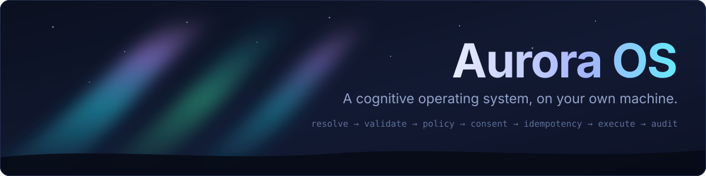

<div align="center">



<br>

<!-- The CI badge belongs here. It is out while GitHub Actions is not running on this repository,
     because a red badge says "this is broken" when what it means is "this has not been run", and
     the first is a worse lie than saying nothing. The workflow itself is in place and unchanged;
     put the badge back the moment a run goes green:

[](https://github.com/paulo16correia/AuroraOS/actions/workflows/ci.yml)
-->
[](LICENSE)
[](https://dotnet.microsoft.com/)
[](https://www.python.org/)
[](tests/)
[](docs/adr/)
[](#supported-platforms)
[](#project-status)

**A cognitive operating system for a persistent digital entity — running on your own machine.**

[Architecture](docs/README.md) · [Kernel](docs/045-aurora-kernel.md) · [Constitution](docs/035-aurora-constitution.md) · [Plugin SDK](docs/060-plugin-sdk.md) · [ADRs](docs/adr/) · [Contributing](CONTRIBUTING.md)

</div>

---

## What this is

Aurora OS is a runtime for an assistant that **persists**: it keeps an identity, a memory with
provenance, a world model, goals, and the ability to act through tools — and it keeps them across
model changes, vendor changes and restarts.

The language model is a **replaceable part**, not the system. Swap Claude for a local Llama and
Aurora's identity, memory, policies, permissions and audit log are unchanged, because none of them
live in the model. The same goes for language: it belongs to the owner's profile and to the
conversation, never to Aurora.

What makes it an operating system rather than a chat wrapper is that **nothing acts without passing
the Kernel**. Every action an assistant wants to take — read a file, send a message, join a call —
travels one path:

```text
resolve → schema validate → policy → consent / approval → idempotency → execute → audit
```

Fail-closed at every step. A capability that cannot be resolved does not run. A payload that fails
its schema does not reach a plugin. An action that needs approval waits for a human, and the
waiting is recorded. Nothing is "assumed allowed because it worked last time".

### What Aurora will not do

Stated as plainly as what it does, because a system that acts on your behalf should be legible at
the edges:

- **It does not act silently.** Every effect is attributable and auditable ([LAW-006](docs/laws/LAW-006-no-silent-autonomy.md)).
- **It does not invent.** Uncertainty is declared, not smoothed over ([Constitution, art. 2](docs/035-aurora-constitution.md)).
- **It does not let a plugin ask it for anything.** The plugin protocol is one-way on purpose: a
  process holding a connection to the outside world can *report* what happened and can never
  *request* that Aurora do something ([LAW-002](docs/laws/LAW-002-mind-tool-isolation.md)).
- **It does not give a plugin the machine.** Plugins run confined — on Windows in a real
  AppContainer, verified rather than assumed ([ADR 0078](docs/adr/)).

---

## Install

> **Aurora is not a packaged product yet.** There is no installer and no release binary. What
> follows builds it from source. See [Project status](#project-status) before you plan around it.

**Requirements:** [.NET 10 SDK](https://dotnet.microsoft.com/download), and Python 3.13 if you want
the plugins. On Linux, plugins run confined by [bubblewrap](https://github.com/containers/bubblewrap)
(`sudo apt install bubblewrap`), and are refused without it.

```bash
git clone https://github.com/paulo16correia/AuroraOS.git
cd AuroraOS
dotnet build
```

Check the machine is fit to run it before running it:

```bash
dotnet run --project src/Aurora.Server -- doctor
```

`doctor` is a preflight, not a smoke test. It checks the database path, that key files are actually
owner-only on disk, the sandbox root, which confinement mechanism is available, and — per plugin —
the manifest, the interpreter, and whether that interpreter can be granted to a confined process.
It exits non-zero on any failure and tells you which one.

---

## Quick start

```bash
# 1. Build and verify the machine
dotnet build
dotnet run --project src/Aurora.Server -- doctor

# 2. Run the tests. All of them should pass; if they do not, that is the bug.
dotnet test
```

Secrets never travel on a command line — they are typed into a prompt and stored in the vault:

```bash
dotnet run --project src/Aurora.Server -- secret set plugin/discord bot_token
```

Then install a plugin, which is an explicit grant of its manifest's permissions and network hosts:

```bash
dotnet run --project src/Aurora.Server -- plugin install src/Aurora.Server/plugins/discord
```

A plugin declaring a host it was not granted does not get to reach it. A plugin declaring a
permission you did not grant does not get the capability. Both refusals are recorded.

---

## How it fits together

```text
        ┌──────────────────────────────────────────────────────────────┐
        │  LLM client  (Claude, Codex, a local model — interchangeable) │
        └───────────────────────────┬──────────────────────────────────┘
                                    │  MCP
        ┌───────────────────────────▼──────────────────────────────────┐
        │                      AURORA KERNEL                           │
        │  resolve → validate → policy → consent → idempotency →       │
        │  execute → audit                    (fail-closed throughout) │
        └───┬───────────────┬───────────────┬──────────────┬───────────┘
            │               │               │              │
     ┌──────▼─────┐  ┌──────▼─────┐  ┌──────▼──────┐  ┌────▼────────┐
     │   Mind     │  │  Memory    │  │  Capability │  │   Vault     │
     │ attention  │  │ provenance │  │  registry   │  │  secrets    │
     │ deliberate │  │ beliefs    │  │  + policy   │  │  owner-only │
     │ decide     │  │ relations  │  │             │  │             │
     └────────────┘  └────────────┘  └──────┬──────┘  └─────────────┘
                                            │  one-way protocol
                            ┌───────────────▼───────────────┐
                            │   Confined plugin processes   │
                            │   AppContainer · no GPU ·     │
                            │   only granted network hosts  │
                            ├───────────────────────────────┤
                            │  discord · voice · microsoft  │
                            └───────────────────────────────┘
```

| Layer | What lives there |
|---|---|
| [`src/Aurora.Core`](src/Aurora.Core) | Contracts, laws, the Kernel boundary. No I/O, no vendors — this is the part that must survive a rewrite of everything else. |
| [`src/Aurora.Adapters`](src/Aurora.Adapters) | SQLite persistence, plugin hosting and sandboxes, personality, presence, vault, diagnostics. |
| [`src/Aurora.Server`](src/Aurora.Server) | The process you run: MCP surface, console, `doctor`, secret entry. |
| [`plugins/`](plugins) | Confined subprocesses. Zero third-party dependencies by design — the Discord plugin writes its own WebSocket, its own RTP, and its own AEAD rather than require a `pip install` before it has been granted a network. |
| [`docs/`](docs) | 202 documents, of which 87 are [ADRs](docs/adr/). The RFCs are normative and use MUST/SHOULD in the RFC 2119 sense. |

---

## Project status

**Controlled demo. Not beta, not production.** This is stated here rather than discovered later.

| | |
|---|---|
| ✅ Kernel authority path, end to end, with audit | Implemented and tested |
| ✅ Approvals decided by a person | The control panel lists each pending request with exactly what it would run; `aurora_approve` decides only with the operator passphrase ([ADR 0088](docs/adr/0088-the-agent-does-not-decide-for-itself.md)) |
| ✅ Windows AppContainer plugin confinement | **Verified on real hardware**, not assumed ([ADR 0078](docs/adr/)) |
| ✅ Owner-only secret protection, fail-closed | Refuses to start rather than store a secret it cannot protect |
| ✅ Discord voice: join, listen, speak, barge-in | Working against real Discord on macOS, including DAVE end-to-end encryption. Not yet run against the real service on Windows or Linux |
| ✅ Speech synthesis | ElevenLabs, streamed. The one thing Aurora does that leaves the machine, and it says so |
| ✅ Language | English by default, the owner's language by preference. Nothing hardcodes a locale |
| ❌ Installer, packaging, releases | Not started |
| ❌ Multi-user, multi-tenant | Out of scope — Aurora is one entity, for one owner |

If you are looking for something to run today, this is not it yet. If you are looking for an
architecture to read, `docs/` is unusually complete.

---

## Supported platforms

| Platform | Runtime | Plugin confinement |
|---|---|---|
| **Windows** 10/11 | ✅ | ✅ AppContainer, verified |
| **Linux** | ✅ | ✅ bubblewrap, verified; refused without it |
| **macOS** | ✅ | ✅ `sandbox-exec`, verified |

Confinement is the reason for the distinction, and it fails closed: where Aurora cannot confine a
plugin, it refuses to run it unless the owner explicitly accepts running unconfined. The detail, and
exactly what has been run where, is in [platform support](docs/reference/platform-support.md).

---

## Contributing

Read [CONTRIBUTING.md](CONTRIBUTING.md) first — it is short, and it explains the two things that
make contributions here different from most repositories: **the tests are the specification**, and
**an architectural decision needs an ADR before it needs code**.

Security issues go to [SECURITY.md](SECURITY.md), never to a public issue.

---

## Licence

[GNU AGPL-3.0](LICENSE).

Copyleft was chosen for a reason that is in the architecture rather than in commerce. Aurora holds
your secrets and acts on your behalf, and its whole claim is that you can *verify* what it does —
[human control](docs/035-aurora-constitution.md), transparency of action, attributable decisions.
A modified Aurora offered to other people as a closed service would be precisely the thing this
project exists to be an alternative to: an assistant you cannot inspect, holding your keys.

The AGPL closes that door and no other. In practice:

- **Running Aurora for yourself triggers nothing.** Use it, modify it, never publish a line.
- **Plugins are not derivative works.** They are separate processes speaking a one-way protocol
  across a sandbox boundary, so a closed-source plugin is fine.
- **Offering a modified Aurora as a service to others** means publishing those modifications.
