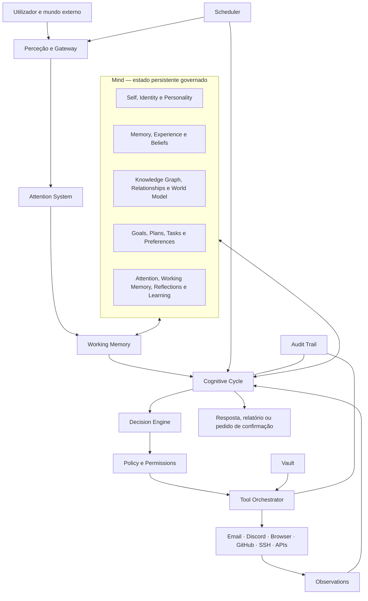

# Aurora OS — RFC 010: Mapa-mestre da Mind

**Estado:** Normativo · **Depende de:** RFC 000–01

## Objetivo

Fixar a planta de arquitetura da Aurora. Qualquer módulo novo DEVE declarar onde vive neste mapa, que dados lê/escreve, que políticas aplica e que eventos emite.

## Mapa de componentes

O mapa desta RFC é a visão de fluxo de ponta a ponta. A RFC 011 introduz a vista complementar por camadas e é a referência para fronteiras de dependência.



## Arquitetura e responsabilidades

```text
Mind              mantém realidade, identidade, intenções e experiências persistentes
Cognitive Cycle   orquestra uma unidade de deliberação sem saltar etapas
Decision Engine   escolhe um modo de ação permitido
Tool Orchestrator materializa uma ação autorizada e observa o resultado
Scheduler         cria eventos temporais; não executa efeitos diretamente
```

## Estruturas e interfaces

```text
MindSnapshot
  snapshot_id, tenant_id, identity_ref, active_goal_refs[]
  memory_summary_ref, world_model_version, attention_state_ref, captured_at

Mind.read(scope, access_context) -> MindSnapshot
Mind.apply(change_set, policy_decision) -> MindSnapshot
ArchitectureRegistry.register(module_manifest) -> Registration
```

## Regras obrigatórias

1. Nenhum módulo externo escreve diretamente na Mind; envia um `ChangeSet` validado.
2. Nenhum módulo salta o `Decision Engine` para chamar uma ferramenta.
3. O Scheduler apenas cria `Event`; uma ação agendada percorre o ciclo cognitivo completo.
4. A fonte de dados, classificação e correlação acompanham cada passagem entre componentes.

## Casos limite e erro

Se a Mind estiver indisponível, ações com efeito são bloqueadas e novas observações ficam numa fila durável. Se Attention ou Working Memory falhar, o ciclo termina em modo seguro, sem recuperar “todas as memórias” como alternativa.

## Justificação

O mapa impede que conectores e modelos se transformem em centros de autoridade. Também torna explícito que a Mente é um sistema de estado, não uma base vetorial.

## Expansões futuras

Sub-Minds por domínio, partilha consentida de conhecimento, módulos de perceção multimodal e escalamento de componentes independentes.
