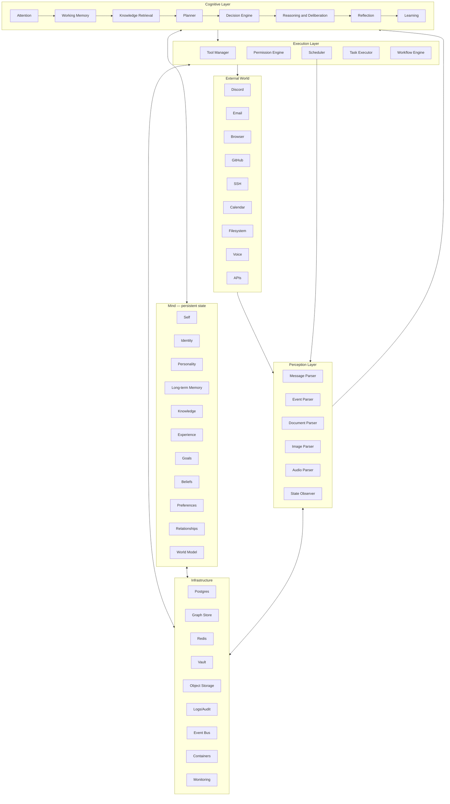

# Aurora OS — RFC 011: Camadas cognitivas e fronteiras de responsabilidade

**Estado:** Normativo · **Depende de:** RFC 000, 010

## Objetivo

Organizar a Aurora OS por camadas cognitivas e operacionais, em vez de uma lista plana de componentes. As camadas descrevem a direção do fluxo de informação e proíbem dependências que destruam isolamento, explicabilidade ou segurança.

## Arquitetura de referência



## Responsabilidades

| Camada | Faz | Não faz |
| --- | --- | --- |
| Mundo externo | produz sinais e recebe efeitos | altera políticas ou a Mind diretamente |
| Perceção | normaliza, autentica e classifica observações | decide objetivos ou executa ações |
| Cognição | seleciona contexto, delibera, planeia e decide | guarda segredos ou contorna permissões |
| Mind | mantém estado canónico, temporal e governado | chama conectores diretamente |
| Execução | autoriza, agenda e materializa decisões | inventa intenção ou factos |
| Infraestrutura | persiste, isola, mede e recupera | define semântica de produto |

## Estruturas e interfaces

```text
LayerEnvelope
  event_id, correlation_id, source_layer, target_layer
  payload_ref, schema_version, sensitivity, integrity, occurred_at

LayerContract
  layer, accepted_event_types[], emitted_event_types[]
  read_scopes[], write_scopes[], forbidden_dependencies[]

LayerRouter.dispatch(envelope) -> DeliveryResult
Architecture.validateDependency(source, target) -> ValidationResult
```

## Regras obrigatórias

1. A comunicação entre camadas DEVE usar contratos versionados e eventos/referências; acesso lateral a armazenamento é proibido salvo interface publicada.
2. A execução não pode escrever factos na Mind: só cria `Observation` e resultados, que voltam pela perceção/ciclo cognitivo.
3. A Mind não pode guardar valores de segredos nem depender da disponibilidade de um conector para preservar estado.
4. O Scheduler pertence à execução, mas desencadeia um `Event` na perceção; nunca chama uma ferramenta diretamente.

## Casos limite e erro

- Falha do mundo externo deixa observações/tarefas pendentes, sem corromper a Mind.
- Falha de perceção põe eventos em quarentena; dados não normalizados nunca entram na cognição.
- Falha de infraestrutura bloqueia alterações e efeitos, preservando leitura degradada quando seguro.

## Justificação

As camadas tornam a Aurora um organismo arquitetural: entradas são percebidas, estado é mantido, decisões são tomadas e ações são executadas por fronteiras claras. Isto previne que um novo conector se torne, acidentalmente, uma nova mente.

## Expansões futuras

Perceção multimodal em tempo real, subcamadas de segurança, execução remota isolada e Minds federadas.

